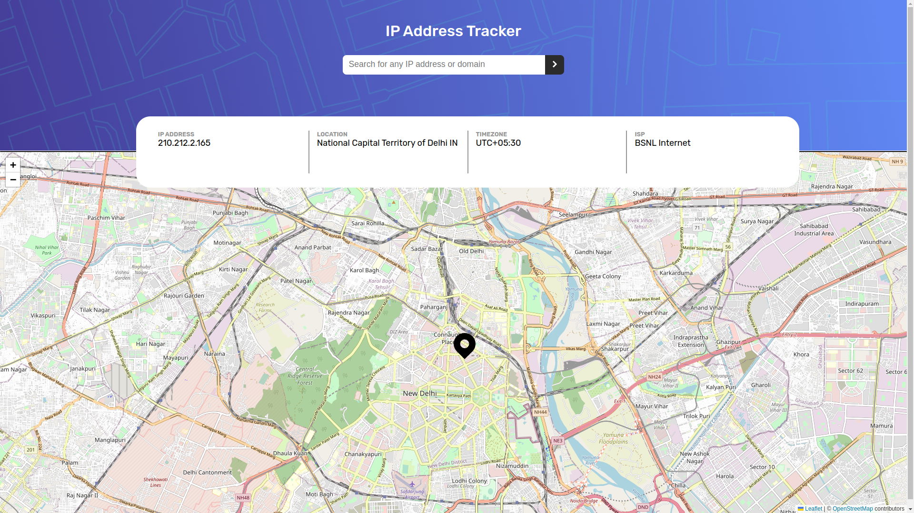
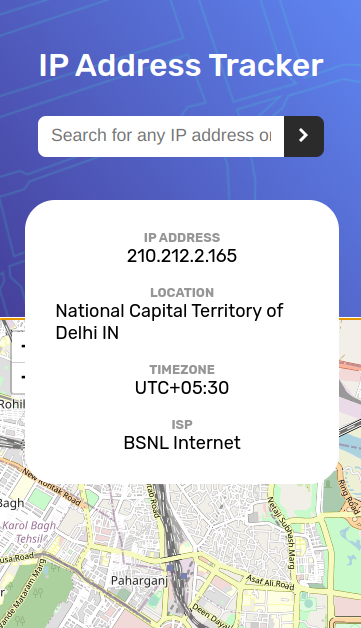
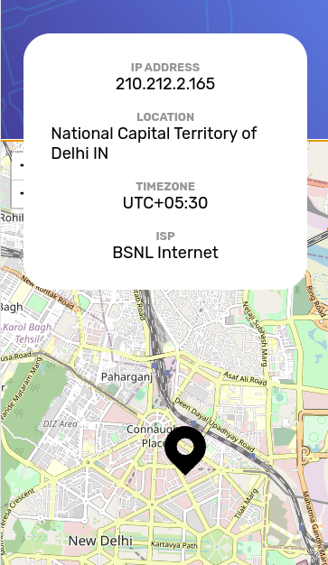

# Frontend Mentor - IP address tracker solution

This is a solution to the [IP address tracker challenge on Frontend Mentor](https://www.frontendmentor.io/challenges/ip-address-tracker-I8-0yYAH0). Frontend Mentor challenges help you improve your coding skills by building realistic projects. 

## Table of contents

- [Frontend Mentor - IP address tracker solution](#frontend-mentor---ip-address-tracker-solution)
  - [Table of contents](#table-of-contents)
  - [Overview](#overview)
    - [Links](#links)
    - [The challenge](#the-challenge)
    - [Screenshot](#screenshot)
  - [My process](#my-process)
    - [Built with](#built-with)
  - [Author](#author)

## Overview

### Links

- Solution URL: [Github](https://github.com/keshavkumarhembram/ip-address-tracker-master)
- Live Site URL: [Live Site](https://keshavkumarhembram.github.io/ip-address-tracker-master/)

### The challenge

Users should be able to:

- View the optimal layout for each page depending on their device's screen size
- See hover states for all interactive elements on the page
- See their own IP address on the map on the initial page load
- Search for any IP addresses or domains and see the key information and location

### Screenshot
- Desktop

- Mobile
  

## My process

### Built with

- Semantic HTML5 markup
- CSS custom properties
- Flexbox
- [IP Geolocation API by IPify](https://geo.ipify.org/).
- [LeafletJS](https://leafletjs.com/)

## Author

- GitHub - [keshavkumarhembram](https://github.com/keshavkumarhembram)
- Frontend Mentor - [@keshavkumarhembram](https://www.frontendmentor.io/profile/keshavkumarhembram)
- Twitter - [@keshavhembram](https://twitter.com/keshavhembram)

